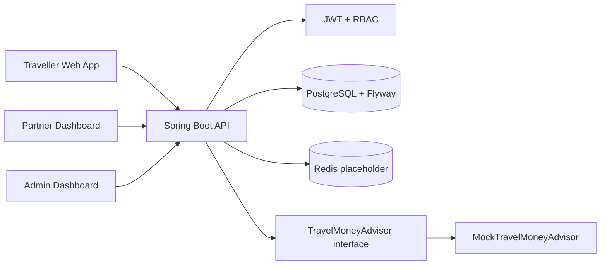
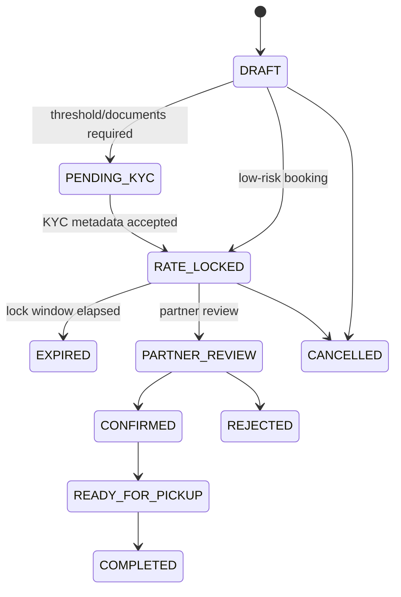
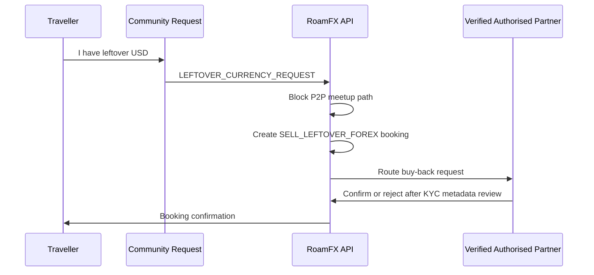

# RoamFX

RoamFX is a production-shaped MVP for a compliance-safe traveller forex marketplace. It connects travellers to verified authorised forex partners, banks, FFMCs, AD Category entities, and travel-forex providers. It intentionally does not provide unlicensed peer-to-peer cash exchange.

## Compliance Note

RoamFX is a technology platform. Currency exchange transactions are completed only through verified authorised partners, subject to applicable laws, KYC, and partner acceptance. In the MVP:

- Public partner/rate search returns only `VERIFIED` partners.
- INR equivalent `>= 50000` cannot use `CASH`.
- Threshold and leftover buy-back bookings require KYC flow.
- Community leftover currency requests are routed to `SELL_LEFTOVER_FOREX` booking flow.
- There is no direct user-to-user exchange endpoint or cash meetup workflow.

## Architecture

### System Architecture



### Booking Lifecycle



### Compliance-Safe Leftover Currency Flow



## Stack

- Frontend: Next.js 14, TypeScript, Tailwind CSS, shadcn-style components, React Hook Form, Zod, TanStack Query.
- Backend: Java 17, Spring Boot 3, Spring Security, JWT, JPA, PostgreSQL, Flyway, OpenAPI.
- Infra: Docker Compose for frontend, backend, postgres, redis.

## Run Locally

```bash
cd roamfx
docker compose up --build
```

Frontend: http://localhost:3000  
Backend: http://localhost:8080  
Swagger: http://localhost:8080/swagger-ui.html

The Compose stack starts PostgreSQL, Redis, the Spring Boot API, and the Next.js frontend with one command. Flyway creates the schema and seeds currencies, partners, and rates automatically; demo users are seeded on API startup with BCrypt hashes.

For separate local development:

```bash
cd roamfx/backend
mvn spring-boot:run

cd roamfx/frontend
npm install
npm run dev
```

## API Response Format

All application API responses use the same envelope:

```json
{
  "success": true,
  "message": "OK",
  "data": {},
  "errorCode": null,
  "timestamp": "2026-04-25T16:30:00Z"
}
```

Errors use `success=false`, a user-safe `message`, and a stable `errorCode`.

## Environment

Copy:

```bash
cp backend/.env.example backend/.env
cp frontend/.env.example frontend/.env.local
```

Backend variables:

| Variable | Purpose | Default |
| --- | --- | --- |
| `SERVER_PORT` | API port | `8080` |
| `DATABASE_URL` | JDBC PostgreSQL URL | `jdbc:postgresql://localhost:5432/roamfx` |
| `DATABASE_USERNAME` | Database user | `roamfx` |
| `DATABASE_PASSWORD` | Database password | `roamfx` |
| `JWT_SECRET` | HS256 signing secret, use a strong production secret | local development secret |
| `JWT_EXPIRY_MINUTES` | Access-token lifetime | `120` |
| `CORS_ALLOWED_ORIGINS` | Comma-separated frontend origins | `http://localhost:3000` |
| `RATE_LOCK_MINUTES` | Rate reservation window | `30` |
| `SUSPICIOUS_DEVIATION_PERCENT` | Rate deviation warning threshold | `8` |
| `AI_PROVIDER` | Travel-money advisor provider: `mock`, `openai`, `bedrock`, or `vertex` | `mock` |

Frontend variables:

| Variable | Purpose | Default |
| --- | --- | --- |
| `NEXT_PUBLIC_API_URL` | Browser-visible backend URL | `http://localhost:8080` |

## Deployment

The repository includes:

- `.github/workflows/ci.yml` for backend tests and frontend builds.
- `.github/workflows/deploy-render.yml` for Render deploy hooks after CI passes.
- `render.yaml` for a Render Blueprint with frontend, backend, and PostgreSQL.

Render setup:

1. Create a new Render Blueprint from this GitHub repository.
2. Review `render.yaml`, especially the database plan and service names.
3. Set production-safe environment variables, including `JWT_SECRET` and `CORS_ALLOWED_ORIGINS`.
4. After services are created, add GitHub repository secrets:
   - `RENDER_BACKEND_DEPLOY_HOOK_URL`
   - `RENDER_FRONTEND_DEPLOY_HOOK_URL`
5. Future pushes to `main` run CI first, then call Render deploy hooks.

Expected Render URLs after Blueprint creation:

- Frontend: `https://roamfx-frontend.onrender.com`
- Backend: `https://roamfx-backend.onrender.com`
- Swagger: `https://roamfx-backend.onrender.com/swagger-ui.html`

## Demo Users

- `traveller@roamfx.app` / `password123`
- `partner@roamfx.app` / `password123`
- `admin@roamfx.app` / `password123`

## Demo Flow

1. Open `/rates` and compare USD/EUR/GBP/AED/SGD/THB/JPY to INR rates.
2. Login with traveller credentials.
3. Open `/dashboard` to see traveller-only guarded surfaces.
4. Create a booking through `POST /api/bookings`.
5. Try `paymentMode=CASH` above INR 50000 and observe the compliance block.
6. Upload KYC metadata using `POST /api/documents`.
7. Login as partner and use partner endpoints to confirm or complete bookings.
8. Login as admin and verify partners/documents; audit logs are written for sensitive actions.
9. Use `/planner` or `POST /api/ai/travel-money-plan` for mock AI guidance.

## AI Provider Architecture

The travel money assistant uses `TravelMoneyAdvisor` as its provider interface. The default `MockTravelMoneyAdvisor` is deterministic and safe for local development. Placeholder implementations exist for `OpenAiTravelMoneyAdvisor`, `BedrockTravelMoneyAdvisor`, and `VertexAiTravelMoneyAdvisor`; each uses the shared `TravelMoneyPromptTemplate` and must return the same typed response contract after real provider integration.

The prompt template explicitly prohibits illegal or unsafe guidance, unlicensed peer-to-peer exchange, and user-to-user cash meetups. It instructs providers to recommend verified authorised partners and include a disclaimer that rates, fees, KYC requirements, and local rules can change.

## Screenshot Placeholders

Add product screenshots here after running the app locally:

| Screen | Placeholder |
| --- | --- |
| Landing and rate comparison | `docs/screenshots/landing.png` |
| Traveller booking flow | `docs/screenshots/traveller-booking.png` |
| Partner dashboard | `docs/screenshots/partner-dashboard.png` |
| Admin audit dashboard | `docs/screenshots/admin-dashboard.png` |

## Roadmap

- Add provider-owned partner accounts and partner-to-user ownership mapping.
- Add settlement ledger, commissions, invoices, and payout reconciliation.
- Replace mock AI with OpenAI, AWS Bedrock, or Vertex AI implementation.
- Integrate Google Maps or Mapbox provider for geospatial search.
- Add object storage and malware scanning for uploaded documents.
- Add production rate limiting, observability, and fraud detection models.

## Public Beta Launch Checklist

- Confirm legal/compliance review of partner onboarding, KYC copy, cash threshold messaging, and leftover currency buyback routing.
- Verify `POST /api/waitlist` and `GET /api/admin/waitlist` in Swagger before launch.
- Connect email notification placeholder to a production provider such as SES, SendGrid, or Postmark.
- Connect analytics placeholder events: `landing_viewed`, `rate_search_started`, `waitlist_joined`, `booking_started`, `booking_completed`.
- Replace demo dashboard data with aggregate APIs for admin and partner workspaces.
- Add privacy policy, terms, cookie notice, and data-retention policy for waitlist and KYC metadata.
- Configure production secrets: `JWT_SECRET`, database credentials, `CORS_ALLOWED_ORIGINS`, and `AI_PROVIDER`.
- Set up uptime checks for frontend, backend, Postgres, and Redis.
- Run a beta smoke test: landing, waitlist submit, rate search, login, booking create, KYC metadata upload, partner confirm, admin audit review.
- Keep the public beta compliant: no peer-to-peer exchange, no user-to-user cash meetup, and all exchange flows through verified authorised partners.
